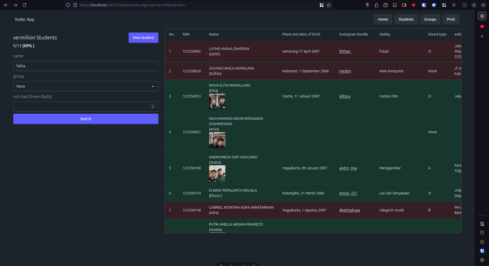

# Kader App


this Astro SSR app

- keeps track of your bonding progress
- generates a page that contains your buku biru images laid out in a grid that you can print and cut right away.

All images are placed in the `public/` directory.

## 🧞 Commands

All commands are run from the root of the project, from a terminal:

| Command                | Action                                           |
| :--------------------- | :----------------------------------------------- |
| `pnpm install`         | Installs dependencies                            |
| `pnpm dev`             | Starts local dev server at `localhost:4321`      |
| `pnpm build`           | Build your production site to `./dist/`          |
| `pnpm preview`         | Preview your build locally, before deploying     |
| `pnpm astro ...`       | Run CLI commands like `astro add`, `astro check` |
| `pnpm astro -- --help` | Get help using the Astro CLI                     |

### Quick start

first copy the .env.example file, name it .env. Set the respective variables:

- DATABASE_URL: where your SQLite database file is located. Defaults to `./database.sqlite`
- UPLOAD_BASE: base to upload your kader images to. set this to whatever you want, I personally set this to `/var/www/images/`.

After setting `UPLOAD_BASE`, you can make a symbolic link from `public/images` to `UPLOAD_BASE` so the app can serve your photos from `UPLOAD_BASE`

```sh
# if you're on UNIX like systems
# make sure to execute the following once in the root of your project
sudo ln -s /var/wwww/images /public/images
```

```sh
# if you're on UNIX like systems
cp .env.example .env
```

and then install dependencies with pnpm

```sh
corepack enable # or whatever installation method you prefer
pnpm i
```

to run the app, use

```sh
pnpm dev
```

then open localhost:4321.

Use the `database.sqlite` file as a base.
